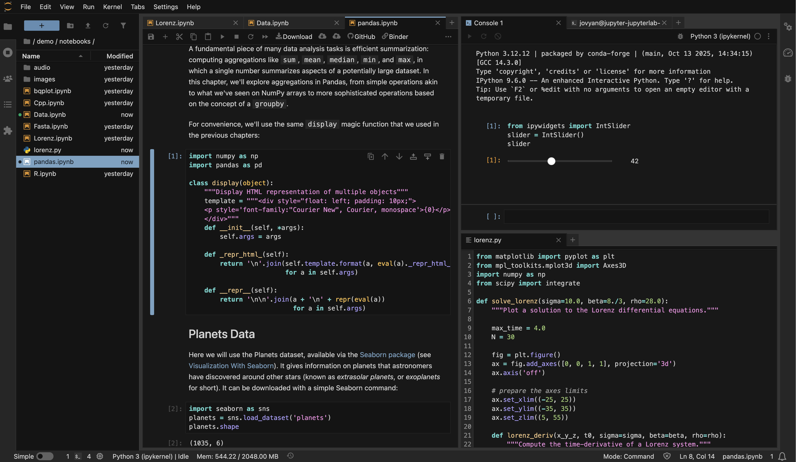
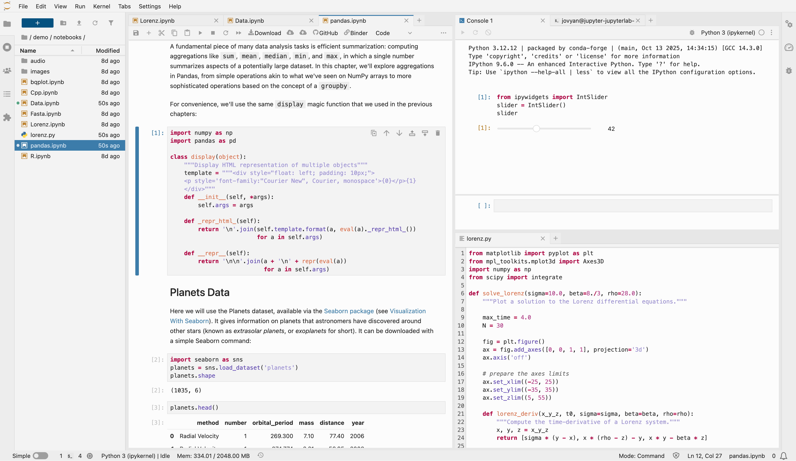

# jupyterlab-cursor-theme

[](https://github.com/jtpio/jupyterlab-cursor-theme/actions/workflows/build.yml)
[](https://jtpio.github.io/jupyterlab-cursor-theme/lab/index.html)

JupyterLab themes with Cursor vibes.




> [!NOTE]
> These themes are heavily inspired by the default Cursor themes, but they are not official Cursor products.

## Packages

This repository contains two JupyterLab theme extensions:

| Package | Description |
| ------- | ----------- |
| [jupyterlab-cursor-dark](./packages/jupyterlab-cursor-dark) | JupyterLab dark theme with Cursor vibes |
| [jupyterlab-cursor-light](./packages/jupyterlab-cursor-light) | JupyterLab light theme with Cursor vibes |

## Try it in your browser

- **https://jtpio.github.io/jupyterlab-cursor-theme**

## Requirements

- JupyterLab >= 4.0.0

## Install

To install the dark theme:

```bash
pip install jupyterlab-cursor-dark
```

To install the light theme:

```bash
pip install jupyterlab-cursor-light
```

Or install both:

```bash
pip install jupyterlab-cursor-dark jupyterlab-cursor-light
```

## Uninstall

```bash
pip uninstall jupyterlab-cursor-dark jupyterlab-cursor-light
```

## Contributing

### Development install

Note: You will need NodeJS to build the extension packages.

The `jlpm` command is JupyterLab's pinned version of
[yarn](https://yarnpkg.com/) that is installed with JupyterLab. You may use
`yarn` or `npm` in lieu of `jlpm` below.

```bash
# Clone the repo to your local environment
# Change directory to the jupyterlab-cursor-theme directory
# Install dependencies
jlpm

# Build all packages
jlpm build

# Install packages in development mode
pip install -e packages/jupyterlab-cursor-dark
pip install -e packages/jupyterlab-cursor-light

# Link your development versions of the extensions with JupyterLab
jupyter labextension develop packages/jupyterlab-cursor-dark --overwrite
jupyter labextension develop packages/jupyterlab-cursor-light --overwrite
```

You can watch the source directory and run JupyterLab at the same time in different terminals to watch for changes in the extension's source and automatically rebuild the extension.

```bash
# Watch the source directory in one terminal, automatically rebuilding when needed
jlpm watch
# Run JupyterLab in another terminal
jupyter lab
```

With the watch command running, every saved change will immediately be built locally and available in your running JupyterLab. Refresh JupyterLab to load the change in your browser (you may need to wait several seconds for the extension to be rebuilt).

### Development uninstall

```bash
pip uninstall jupyterlab_cursor_dark jupyterlab_cursor_light
```

In development mode, you will also need to remove the symlinks created by `jupyter labextension develop`
command. To find their location, you can run `jupyter labextension list` to figure out where the `labextensions`
folder is located. Then you can remove the symlinks named `jupyterlab-cursor-dark` and `jupyterlab-cursor-light` within that folder.

### Packaging the extension

See [RELEASE](RELEASE.md)
